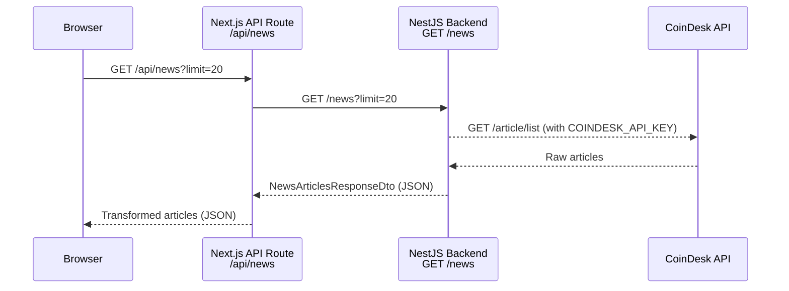

# Design Document: News Server-Side Proxy

## Overview

The webapp currently calls `newsapi.org` directly from the browser with a hardcoded API key embedded in `apps/webapp/lib/api-services.ts`. This exposes the key to anyone who inspects the page source or network traffic.

The fix is a two-part change:

1. **Webapp side** – Replace the direct `NewsApiService` call with a fetch to a Next.js API route (`/api/news`). The route runs server-side, so the key never reaches the browser.
2. **Backend side** – The existing NestJS `NewsController` at `GET /news` already proxies CoinDesk. The webapp's new API route will forward requests to this backend endpoint, keeping all external API communication on the server.

The existing news UX (grid layout, filters, sort, fallback, loading skeletons) is preserved unchanged.

---

## Architecture



**Key security property:** API keys only exist in server-side environment variables. The browser never sees them.

---

## Components and Interfaces

### 1. Next.js API Route – `apps/webapp/app/api/news/route.ts`

A thin proxy that:
- Reads `BACKEND_API_URL` from the server-side environment (defaults to `http://localhost:3001`)
- Forwards query params (`limit`, `lang`, `tag`, `category`) to the backend
- Returns the backend response as-is, or a 502 on failure

```typescript
// Shape returned to the browser
interface ProxiedNewsResponse {
  articles: ProxiedArticle[];
  totalCount: number;
  fetchedAt: string;
}

interface ProxiedArticle {
  id: string;
  title: string;
  body: string;
  url: string;
  imageUrl: string | null;
  authors: string;
  source: string;
  categories: string[];
  keywords: string[];
  sentiment: string;
  publishedAt: string;
  relatedCoins: string[];
}
```

### 2. Webapp News Client Service – `apps/webapp/lib/news-client.ts`

Replaces `NewsApiService`. Calls `/api/news` (same origin, no key needed) and transforms the response into the `NewsData` shape the `NewsSection` component already expects.

```typescript
export interface NewsData {
  id: number;
  title: string;
  excerpt: string;
  category: string;
  author: string;
  date: string;
  imageUrl: string;
  url: string;
  sentiment: "Bullish" | "Bearish" | "Neutral";
  fundingStatus: "Funded" | "Seeking Funding" | "Closed";
  timestamp: number;
}

export async function fetchCryptoNews(limit = 20): Promise<NewsData[]>
```

### 3. Updated `NewsSection` component – `apps/webapp/components/news-section.tsx`

- Remove import of `NewsApiService` and `transformNewsData` from `api-services`
- Import `fetchCryptoNews` from `lib/news-client` instead
- All other logic (filters, sort, fallback, loading state) stays identical

### 4. Cleaned `api-services.ts` – `apps/webapp/lib/api-services.ts`

- Remove `NewsApiService` class (hardcoded key + direct newsapi.org call)
- Remove `NewsApiData` interface
- Remove `transformNewsData` utility
- Keep `CryptoApiService` and `transformCryptoData` untouched

### 5. Environment variable – `apps/webapp/.env.local.example`

```
# URL of the NestJS backend (server-side only, not prefixed with NEXT_PUBLIC_)
BACKEND_API_URL=http://localhost:3001
```

---

## Data Models

### Backend → Next.js API Route (existing `NewsArticlesResponseDto`)

```typescript
{
  articles: NewsArticleDto[];   // id, title, body, url, imageUrl, authors, source,
                                // categories, keywords, sentiment, publishedAt, relatedCoins
  totalCount: number;
  fetchedAt: string;
}
```

### Next.js API Route → Browser (`NewsData`)

```typescript
{
  id: number;
  title: string;
  excerpt: string;          // mapped from body (first 200 chars) or subtitle
  category: string;         // first entry from categories[], or "Crypto"
  author: string;           // from authors field
  date: string;             // formatted from publishedAt
  imageUrl: string;         // imageUrl or picsum fallback
  url: string;
  sentiment: "Bullish" | "Bearish" | "Neutral";   // derived from sentiment field
  fundingStatus: "Funded" | "Seeking Funding" | "Closed";  // random, as before
  timestamp: number;        // Date.parse(publishedAt)
}
```

---

## Correctness Properties

*A property is a characteristic or behavior that should hold true across all valid executions of a system-essentially, a formal statement about what the system should do. Properties serve as the bridge between human-readable specifications and machine-verifiable correctness guarantees.*

**Property Reflection:**
- 2.5 (fallback on error) and 7.1 (fallback on backend unavailability) are the same behavior — merged into Property 3.
- 3.1 (category filter) and 3.2 (sentiment filter) follow the same pattern — merged into Property 4 (general filter correctness).
- 1.1 (no direct external calls) and 1.3/1.5 (no hardcoded keys) are all code-scanning properties — kept as separate properties since they check different things.

---

Property 1: No hardcoded API keys in webapp source
*For any* file in `apps/webapp/`, the file content SHALL NOT contain the string `2337f3f8a0e7479da03bf070dfce37b9` or any pattern matching a known API key assignment (`NEWS_API_KEY`, `newsapi.org` with an auth header).
**Validates: Requirements 1.3, 1.5, 8.1, 8.2**

---

Property 2: Article transformation completeness
*For any* `NewsArticleDto` returned by the backend, the `transformBackendArticle` function SHALL produce a `NewsData` object where `title`, `url`, `author`, `date`, `imageUrl`, `category`, and `timestamp` are all non-empty/non-zero.
**Validates: Requirements 2.2, 4.4**

---

Property 3: Fallback on fetch failure
*For any* error thrown by `fetchCryptoNews`, the `NewsSection` component SHALL set `isUsingFallback` to `true` and render the `Web3NewsFallback` component instead of the article grid.
**Validates: Requirements 2.5, 7.1**

---

Property 4: Filter correctness
*For any* list of `NewsData` articles and any non-"All" filter value (category, sentiment, or fundingStatus), the filtered result SHALL contain only articles where the corresponding field equals the filter value.
**Validates: Requirements 3.1, 3.2, 3.3**

---

Property 5: Caching round-trip
*For any* two consecutive calls to the backend `GET /news` endpoint within the cache TTL window, the second response SHALL return the same `fetchedAt` timestamp as the first, confirming the cached response was served.
**Validates: Requirements 6.1, 6.2**

---

## Error Handling

| Scenario | Behavior |
|---|---|
| Backend unreachable | Next.js API route returns 502; `NewsSection` catches the error, sets `isUsingFallback = true` |
| Backend returns 4xx/5xx | Same as above |
| Request timeout (>10 s) | `fetchCryptoNews` throws; fallback shown |
| Empty articles array | `isUsingFallback = true` (same as current behavior) |
| Missing `BACKEND_API_URL` env var | Defaults to `http://localhost:3001` |

---

## Testing Strategy

### Unit tests (Vitest, webapp)

- `transformBackendArticle` with a valid `NewsArticleDto` → all fields populated
- `transformBackendArticle` with missing optional fields → graceful defaults
- `fetchCryptoNews` when the API route returns 200 → returns `NewsData[]`
- `fetchCryptoNews` when the API route returns 500 → throws an error

### Property-based tests (fast-check, webapp)

The webapp uses Vitest. We will add `fast-check` as a dev dependency for property-based testing.

Each property-based test MUST be tagged with:
`// Feature: news-server-side-proxy, Property {N}: {property_text}`

Each test runs a minimum of 100 iterations.

- **Property 1** – Scan `apps/webapp/lib/api-services.ts` for absence of `NewsApiService` and hardcoded key string.
- **Property 2** – Generate arbitrary `NewsArticleDto` objects; assert `transformBackendArticle` always produces a complete `NewsData`.
- **Property 3** – Simulate `fetchCryptoNews` throwing; assert `NewsSection` state transitions to fallback.
- **Property 4** – Generate arbitrary article arrays and filter values; assert filtered output only contains matching articles.
- **Property 5** – Integration-level: two sequential calls within TTL return same `fetchedAt`.

### Backend tests (Jest, NestJS)

The existing `NewsController` and `NewsProviderService` tests cover the backend endpoint. No new backend tests are required beyond verifying the `/news` endpoint returns the expected DTO shape.
